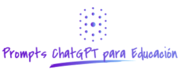

<div align="center">

<!-- title -->

# Prompts generales para preparación de oposiciones
</div>

## Contenido
- [Prompt 01 - Preguntas al finalizar defensa programación didáctica](#prompt01)
- [Prompt 02 - Preguntas al finalizar defensa unidad didáctica](#prompt02)
- [Prompt 03 - Esquema de un tema a preparar](#prompt03)
- [Prompt 04 - Test sobre gestión de conflictos en el aula en ciclos formativos](#prompt04)
## Prompts
## <a name="prompt01"></a> Prompt 01 - Preguntras al finalizar defensa programación didáctica
```
Actua como un tribunal de profesores de secundaria. Supon que te he realizado una defensa de una programación didactica del módulo "Programación de procesos y servicios" perteneciente al ciclo formativo de grado superior "Desarrollo de aplicaciones multiplataforma".
En primer lugar, muestrame tu un  ejemplo de unidades didácticas que debería haber tenido mi programación didáctica.

Tras ello, quiero que me hagas preguntas sobre didáctica relacionadas con mi programación didáctica.

Las preguntas las vas a hacer de una en una y vas a esperar mi respuesta.

Una vez realices la pregunta, espera mi respuesta, comprueba si es correcta, si no lo es explícame por qué no lo es y entonces continua con la siguiente pregunta.

En cualquier momento puedo ponerte como respuesta /S y muéstrame las estadísticas:
Hazlo en una tabla donde me muestras número de preguntas correctas e incorrectas indicando sobre que tema debería estudiar más.
```

## <a name="prompt02"></a> Prompt 02 - Preguntras al finalizar defensa unidad didáctica
```
Actua como un tribunal de profesores de secundaria. Supon que te he realizado una defensa de una unidad didactica llamada "Programación concurrente" del módulo "Programación de procesos y servicios" perteneciente al ciclo formativo de grado superior "Desarrollo de aplicaciones multiplataforma". 
Ahora, quiero que me hagas preguntas sobre didáctica relacionadas con mi unidad.

Las preguntas las vas a hacer de una en una y vas a esperar mi respuesta.

Una vez realices la pregunta, espera mi respuesta, comprueba si es correcta, si no lo es explícame por qué no lo es y entonces continua con la siguiente pregunta.

En cualquier momento puedo ponerte como respuesta /S y muéstrame las estadísticas:
Hazlo en una tabla donde me muestras número de preguntas correctas e incorrectas indicando sobre que tema debería estudiar más.
```

## <a name="prompt03"></a> Prompt 03 - Esquema de un tema a preparar
```
Actua como un tribunal de profesores de secundaria de la especialidad informática. Te diré el nombre de un tema que debo desarrollar por escrito en dos horas.
Cuando te diga el nombre de tema, quiero que me hagas un esquema con los puntos que debería desarrollar, incluyendo introducción, conclusión y bibliografía.

Si te pido más detalle de algún punto concreto, intentarás desarrollarmelo y si me parece poco detallado, te diré que lo detalles más".
```

## <a name="prompt04"></a> Prompt 04 - Test sobre gestión de conflictos en el aula en ciclos formativos
```
Actúa como si fueras un tribunal de oposiciones de secuncaria. Tienes que hacerme una pregunta sobre gestión de conflictos en el aula en ciclos formativos y darme 5 respuestas A, B, C, D y E vas a felicitarme si respondo correctamente y corregirme si lo hago incorrectamente. Las preguntas las vas a hacer de una en una y vas a esperar mi respuesta. Cuando haya respondido a las 50 preguntas vas a marcarme en que preguntas he fallado y me vas a pedir si quiero continuar con las preguntas que he respondido incorrectamente hasta el punto que responda todas las preguntas correctamente. 

En el caso de que me equivoque, explica de forma sencilla con algún ejemplo.

Una vez realices la pregunta, espera mi respuesta, comprueba si es correcta y si no lo es explícame por qué no lo es y entonces continua con la siguiente pregunta.

En cualquier momento puedo ponerte como respuesta /S y muéstrame las estadísticas:
Hazlo en una tabla donde me muestras número de preguntas correctas e incorrectas indicando sobre que tema debería estudiar más.
```

### Licencia y autores que han contribuido

CC BY-SA 3.0 ES https://creativecommons.org/licenses/by-sa/3.0/es/. Recuerda, los materiales licenciados con CC BY-SA pueden ser usados, modificados y redistribuidos, pero no olvides referenciar al autor y compartir con la misma licencia BY-SA.

La lista de autores que han contribuido se encuentran en el ["README.md" principal del repositorio.](https://github.com/sergarb1/awesome-list-prompts-chagpt-educacion/blob/main/README.md)