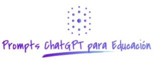

<div align="center">

<!-- title -->

# Prompts generales para profesorado
</div>

## Contenido
- [Prompt 01 - Preparación de taller de repaso](#prompt01)
- [Prompt 02 - Ejemplos didácticos para explicar un concepto](#prompt02)
- [Prompt 03 - Ideas de actividades para aprender un concepto](#prompt03)

## Prompts
## <a name="prompt01"></a> Prompt 01 - Preparación de taller de repaso
```
Actúa como un profesor de informática. Quiero que me propongas un taller de repaso para alumnado que ha finalizado el grado medio de "Sistemas Microinformaticos y Redes" donde repasen todos los pasos sobre como configurar la BIOS/UEFI de un ordenador para permitir arranque por USB (tanto de una ISO como MultiISO) y tras ello instalar en una máquina un sistema operativo Linux Ubuntu y un sistema operativo Windows con arranque dual, instalando primero el sistema Windows.

El taller debe durar 2 horas.

Quiero que relacionado con el taller me digas: 
-Título del taller.
-Introducción. Aquí se explicará brevemente en que consiste el taller.
-Material necesario. Indicar qué material hace falta y que será aportado por el centro educativo.
-Actividades a realizar, indicando el tiempo estimado de duración de cada una. En cada actividad habrá un apartado con consejos para el profesorado.
-Preguntas frecuentes que pueden salir durante el taller, incluyendo la respuesta a esa preguntas. Se debe incluir la pregunta porque se recomienda instalar Windows antes que Linux para arranque dual. Este listado debe ser extenso para cubrir la mayor parte de dudas que puedan surgir al alumnado.
```

## <a name="prompt02"></a> Prompt 02 - Ejemplos didácticos para explicar un concepto
```
Actúa como un profesor de secundaria de matemáticas. Quiero que me des ejemplos didácticos para que el alumando aprenda el concepto de derivada, el concepto de integral y como se relacionan entre si.
Me propondrás un conjunto de ejemplos 10 ejemplos entre los que habrá temáticas como: el cine, el deporte, la informática, la astronomia, la cocina, las relaciones sociales y otros temas que te parezcan de interés.
Cuando acabe, me preguntarás si necesito más ejemplos.

```

## <a name="prompt03"></a> Prompt 03 - Ideas de actividades para aprender un concepto
```
Actúa como un profesor de secundaria de informática. Quiero que me des ideas de actividades para que el alumando practique los bucles en programación.
Me propondrás un conjunto de actividades entre las que habrá temáticas de la vida cotidiana. Estas actividades podrán ser individuales o grupales.
Además, me dirás como evaluarás cada actividad.
Cuando acabe, me preguntarás si necesito más actividades.
```


### Licencia y autores que han contribuido

CC BY-SA 3.0 ES https://creativecommons.org/licenses/by-sa/3.0/es/. Recuerda, los materiales licenciados con CC BY-SA pueden ser usados, modificados y redistribuidos, pero no olvides referenciar al autor y compartir con la misma licencia BY-SA.

La lista de autores que han contribuido se encuentran en el ["README.md" principal del repositorio.](https://github.com/sergarb1/awesome-list-prompts-chagpt-educacion/blob/main/README.md)